测试工具管理服务：
好的,我根据你提供的需求,为测试工具管理服务设计了两组接口:基础接口和对其他服务提供的接口。

基础接口:

1. 创建测试工具接口
   - 请求方法: POST
   - 路径: /test-tools/

2. 获取测试工具列表接口
   - 请求方法: GET
   - 路径: /test-tools/

3. 获取单个测试工具详情接口
   - 请求方法: GET
   - 路径: /test-tools/{tool_id}/

4. 更新测试工具接口
   - 请求方法: PUT
   - 路径: /test-tools/{tool_id}/

5. 删除测试工具接口
   - 请求方法: DELETE
   - 路径: /test-tools/{tool_id}/

6. 上传测试工具文件接口
   - 请求方法: POST
   - 路径: /test-tools/upload/

7. 创建产品工具关联接口
   - 请求方法: POST
   - 路径: /product-tools/

8. 获取产品工具关联列表接口
   - 请求方法: GET
   - 路径: /product-tools/

9. 获取单个产品工具关联详情接口
   - 请求方法: GET
   - 路径: /product-tools/{product_tool_id}/

10. 更新产品工具关联接口
    - 请求方法: PUT
    - 路径: /product-tools/{product_tool_id}/

11. 删除产品工具关联接口
    - 请求方法: DELETE
    - 路径: /product-tools/{product_tool_id}/

对其他服务提供的接口:

1. 获取某个产品关联的测试工具列表接口
   - 请求方法: GET
   - 路径: /products/{product_id}/test-tools/

2. 获取某个产品关联的测试工具详情接口
   - 请求方法: GET
   - 路径: /products/{product_id}/test-tools/{tool_id}/

3. 检查某个产品是否关联了指定的测试工具接口
   - 请求方法: GET
   - 路径: /products/{product_id}/test-tools/{tool_id}/check/

这些接口涵盖了测试工具管理服务的基本功能,包括:

- 测试工具的创建、读取、更新、删除
- 测试工具文件的上传
- 产品与测试工具关联关系的创建、读取、更新、删除

同时,也提供了针对其他服务的接口,
- 查询某个产品关联的测试工具信息。


好的,我明白了。你希望在 Mermaid 图中体现出测试工具管理服务通过调用产品管理服务的接口来获取产品详情,而不是直接访问 Product 模型。以下是修改后的 Mermaid 图:

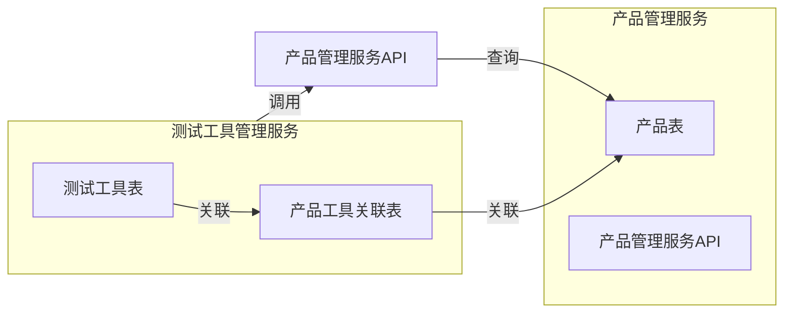

这个 Mermaid 图展示了测试工具管理服务与产品管理服务之间的交互:

1. 测试工具管理服务中包含两个表:
   - `test_tool` 表:存储测试工具的基本信息。
   - `product_tool` 表:存储产品和测试工具之间的关联关系。

2. 产品管理服务中包含:
   - `product` 表:存储产品的基本信息。
   - 产品管理服务 API:提供对产品数据的访问接口。

3. 当测试工具管理服务需要获取产品详情时,它会调用产品管理服务提供的 API 接口,而不是直接访问 `product` 表。

4. 产品管理服务接收到请求后,通过查询 `product` 表获取产品数据,并将结果返回给测试工具管理服务。

5. `product_tool` 表通过关联 `test_tool` 表和 `product` 表,建立起测试工具和产品之间的多对多关系。

通过这种设计,测试工具管理服务和产品管理服务实现了解耦。测试工具管理服务不需要直接访问 `product` 表,而是通过调用产品管理服务提供的 API 来获取所需的产品数据。这提高了系统的可维护性和扩展性。

如果你对这个 Mermaid 图还有任何其他的想法或建议,欢迎随时提出,我们可以一起进一步优化这个方案。


节点管理服务：

好的,我根据你的需求,设计了节点管理服务的基础接口、对其他服务提供的接口,以及一个 Mermaid 图来展示服务之间的交互关系。

基础接口:

1. 创建节点接口
   - 请求方法: POST
   - 路径: /nodes/

2. 获取节点列表接口
   - 请求方法: GET
   - 路径: /nodes/

3. 获取单个节点详情接口
   - 请求方法: GET
   - 路径: /nodes/{node_id}/

4. 更新节点接口
   - 请求方法: PUT
   - 路径: /nodes/{node_id}/

5. 删除节点接口
   - 请求方法: DELETE
   - 路径: /nodes/{node_id}/

6. 创建节点产品关联接口
   - 请求方法: POST
   - 路径: /node-products/

7. 获取节点产品关联列表接口
   - 请求方法: GET
   - 路径: /node-products/

8. 获取单个节点产品关联详情接口
   - 请求方法: GET
   - 路径: /node-products/{node_product_id}/

9. 更新节点产品关联接口
   - 请求方法: PUT
   - 路径: /node-products/{node_product_id}/

10. 删除节点产品关联接口
    - 请求方法: DELETE
    - 路径: /node-products/{node_product_id}/

11. 创建节点工具关联接口
    - 请求方法: POST
    - 路径: /node-tools/

12. 获取节点工具关联列表接口
    - 请求方法: GET
    - 路径: /node-tools/

13. 获取单个节点工具关联详情接口
    - 请求方法: GET
    - 路径: /node-tools/{node_tool_id}/

14. 更新节点工具关联接口
    - 请求方法: PUT
    - 路径: /node-tools/{node_tool_id}/

15. 删除节点工具关联接口
    - 请求方法: DELETE
    - 路径: /node-tools/{node_tool_id}/

对其他服务提供的接口:

1. 获取安装了某产品及测试工具的节点列表接口
   - 请求方法: GET
   - 路径: /products/{product_id}/tools/{tool_id}/nodes/

2. 获取安装了某产品的节点列表接口
   - 请求方法: GET
   - 路径: /products/{product_id}/nodes/

3. 获取安装了某测试工具的节点列表接口
   - 请求方法: GET
   - 路径: /tools/{tool_id}/nodes/

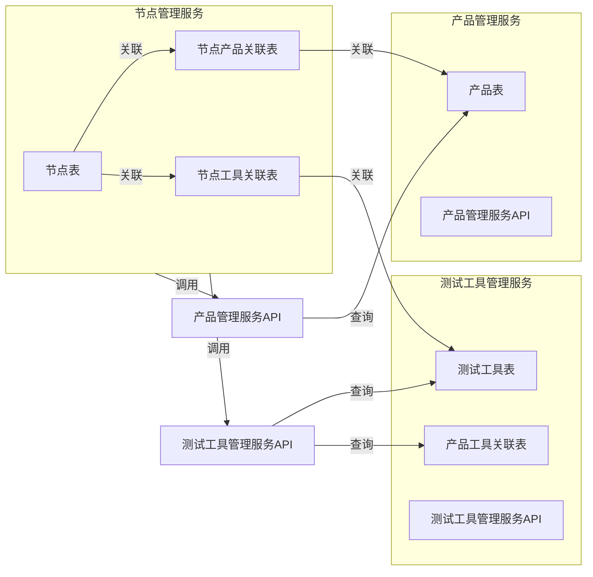

这个 Mermaid 图展示了节点管理服务与产品管理服务、测试工具管理服务之间的交互关系:

1. 节点管理服务中包含三个表:
   - `node` 表:存储节点的基本信息。
   - `node_product` 表:存储节点和产品之间的关联关系。
   - `node_tool` 表:存储节点和测试工具之间的关联关系。

2. 当节点管理服务需要获取产品列表或产品详情时,它会调用产品管理服务提供的 API 接口。

3. 当节点管理服务需要获取测试工具列表、产品工具关联列表或测试工具详情时,它会调用测试工具管理服务提供的 API 接口。

4. 产品管理服务和测试工具管理服务接收到请求后,分别查询各自的数据表,并将结果返回给节点管理服务。

5. `node_product` 表和 `node_tool` 表分别与 `product` 表和 `test_tool` 表建立关联关系,用于存储节点上安装的产品和测试工具信息。

通过这种设计,节点管理服务通过调用其他服务提供的 API 接口来获取所需的数据,而不是直接访问其他服务的数据表。这样可以实现服务之间的解耦,提高系统的可维护性和扩展性。

如果你对这个设计还有任何其他的想法或建议,欢迎随时提出,我们可以一起进一步优化这个方案。


测试执行管理服务：
好的,我根据你的需求,为测试执行管理服务设计了基础接口、对其他服务提供的接口,以及一个 Mermaid 图来展示服务之间的交互关系。

基础接口:

1. 创建任务接口
   - 请求方法: POST
   - 路径: /tasks/

2. 获取任务列表接口
   - 请求方法: GET
   - 路径: /tasks/

3. 获取单个任务详情接口
   - 请求方法: GET
   - 路径: /tasks/{task_id}/

4. 更新任务接口
   - 请求方法: PUT
   - 路径: /tasks/{task_id}/

5. 删除任务接口
   - 请求方法: DELETE
   - 路径: /tasks/{task_id}/

6. 取消任务接口
   - 请求方法: POST
   - 路径: /tasks/{task_id}/cancel/

7. 获取任务进度接口
   - 请求方法: GET
   - 路径: /tasks/{task_id}/progress/

8. 创建案例接口
   - 请求方法: POST
   - 路径: /cases/

9. 获取案例列表接口
   - 请求方法: GET
   - 路径: /cases/

10. 获取单个案例详情接口
    - 请求方法: GET
    - 路径: /cases/{case_id}/

11. 更新案例接口
    - 请求方法: PUT
    - 路径: /cases/{case_id}/

12. 删除案例接口
    - 请求方法: DELETE
    - 路径: /cases/{case_id}/

对其他服务提供的接口:

1. 获取任务状态接口
   - 请求方法: GET
   - 路径: /tasks/{task_id}/status/

2. 获取任务进度接口
   - 请求方法: GET
   - 路径: /tasks/{task_id}/progress/

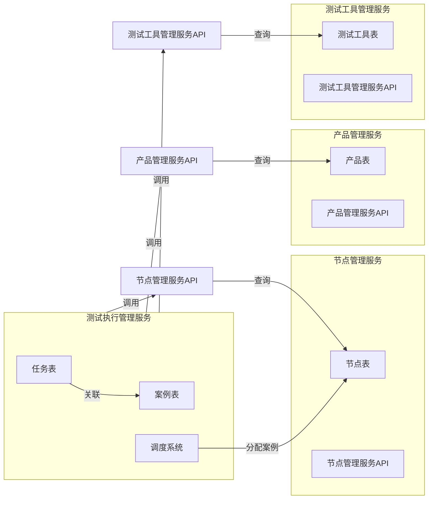

这个 Mermaid 图展示了测试执行管理服务与节点管理服务、产品管理服务、测试工具管理服务之间的交互关系:

1. 测试执行管理服务中包含三个主要组件:
   - `task` 表:存储测试任务的基本信息。
   - `case` 表:存储测试案例的基本信息和执行结果。
   - 调度系统:负责将测试案例分配到合适的节点上执行。

2. 当测试执行管理服务接收到前端的任务请求时,它会根据任务描述中的产品和测试工具要求,调用节点管理服务的 API 接口获取符合要求的节点列表。

3. 测试执行管理服务还会调用产品管理服务和测试工具管理服务的 API 接口,获取任务所需的产品和测试工具信息。

4. 调度系统根据获取到的节点列表,将测试案例分配到具体的节点上执行。

5. 测试执行管理服务通过协程和远程 SSH 执行的方式,在节点上运行测试案例,并将执行结果写入 `case` 表中。

6. 其他服务可以通过调用测试执行管理服务提供的 API 接口,获取任务的状态和进度信息。

通过这种设计,测试执行管理服务通过调用其他服务提供的 API 接口来获取所需的数据,并利用调度系统将测试案例分配到合适的节点上执行。这样可以实现服务之间的解耦,提高系统的可维护性和扩展性。

如果你对这个设计还有任何其他的想法或建议,欢迎随时提出,我们可以一起进一步优化这个方案。

报表管理服务：
好的,我根据你的需求,为报表管理服务设计了基础接口、对其他服务提供的接口,以及一个 Mermaid 图来展示服务之间的交互关系。

基础接口:

1. 生成任务报表接口
   - 请求方法: POST
   - 路径: /reports/tasks/{task_id}/

2. 获取任务报表列表接口
   - 请求方法: GET
   - 路径: /reports/tasks/

3. 获取单个任务报表详情接口
   - 请求方法: GET
   - 路径: /reports/tasks/{report_id}/

4. 删除任务报表接口
   - 请求方法: DELETE
   - 路径: /reports/tasks/{report_id}/

对其他服务提供的接口:

1. 获取任务报表详情接口
   - 请求方法: GET
   - 路径: /reports/tasks/{report_id}/

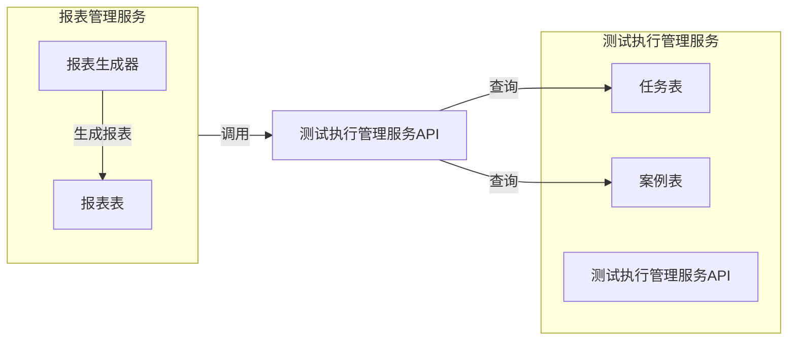

这个 Mermaid 图展示了报表管理服务与测试执行管理服务之间的交互关系:

1. 报表管理服务中包含两个主要组件:
   - `report` 表:存储生成的任务报表信息。
   - 报表生成器:负责根据任务和案例数据生成报表。

2. 当报表管理服务接收到生成任务报表的请求时,它会调用测试执行管理服务的 API 接口,获取指定任务的详细信息以及关联的案例列表。

3. 报表生成器根据获取到的任务和案例数据,统计分析得到报表数据,如运行通过率等指标,并将生成的报表信息存储到 `report` 表中。

4. 其他服务可以通过调用报表管理服务提供的 API 接口,获取生成的任务报表详情。

通过这种设计,报表管理服务通过调用测试执行管理服务提供的 API 接口来获取所需的任务和案例数据,并利用报表生成器生成统计报表。这样可以实现服务之间的解耦,提高系统的可维护性和扩展性。

如果你对这个设计还有任何其他的想法或建议,欢迎随时提出,我们可以一起进一步优化这个方案。


总体mermaid：
好的,我根据之前的讨论,为你整理了一个完整的 Mermaid 图,展示了各个服务之间的交互关系以及它们与数据库表的关联:

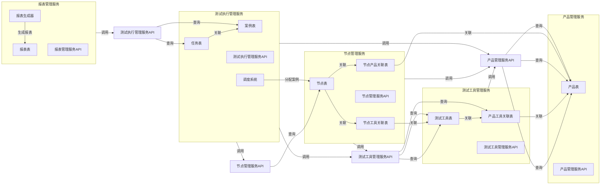

这个 Mermaid 图清晰地展示了测试管理系统中各个服务之间的交互关系,以及它们与相关数据库表的关联:

1. 测试工具管理服务通过调用产品管理服务的 API 获取产品信息,同时管理测试工具表和产品工具关联表。

2. 节点管理服务通过调用产品管理服务的 API 获取产品信息,通过调用测试工具管理服务的 API 获取测试工具和产品工具关联信息,同时管理节点表、节点产品关联表和节点工具关联表。

3. 测试执行管理服务通过调用节点管理服务的 API 获取节点信息,通过调用产品管理服务的 API 获取产品信息,通过调用测试工具管理服务的 API 获取测试工具信息,同时管理任务表和案例表,并通过调度系统将案例分配到节点上执行。

4. 报表管理服务通过调用测试执行管理服务的 API 获取任务和案例信息,通过报表生成器生成报表并存储在报表表中。

这种设计实现了服务之间的解耦,每个服务都通过 API 调用来获取所需的数据,而不是直接访问其他服务的数据库表。这提高了系统的可维护性、可扩展性和安全性。

如果你对这个 Mermaid 图还有任何其他的想法或建议,欢迎随时提出,我们可以一起进一步优化这个设计。


========== 整体 ================

好的,我理解你的需求。我将从不同角度为你提供几个 Mermaid 图,从简略到详细,以展示测试管理系统的不同视角。

1. 简略版服务交互图:

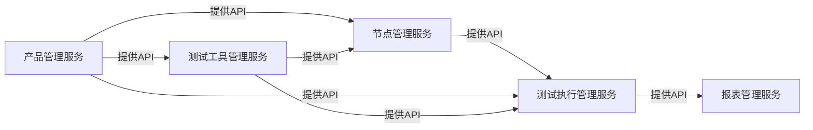

2. 服务与数据库关联图:

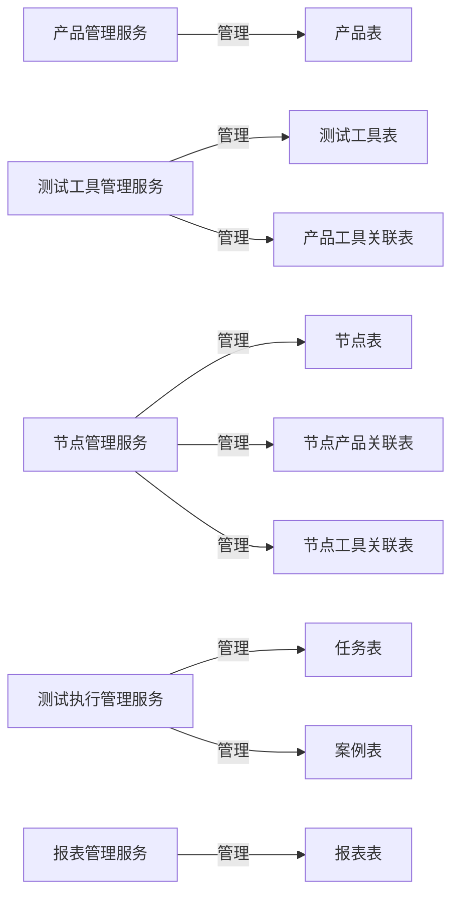

3. 详细版服务交互与数据流图:

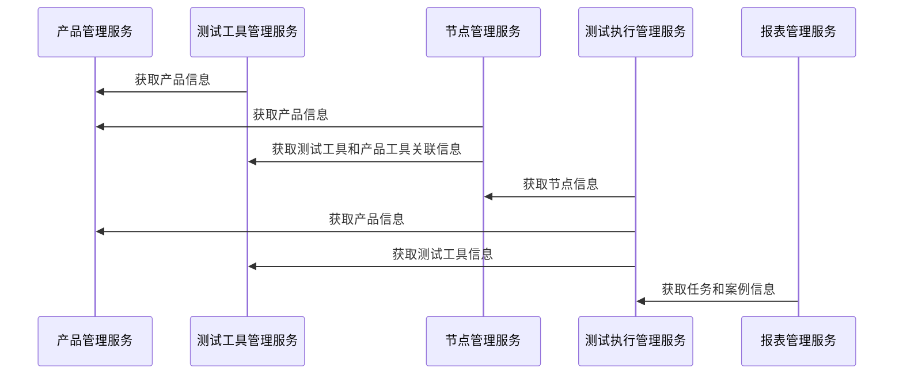

4. 数据库表关联图:

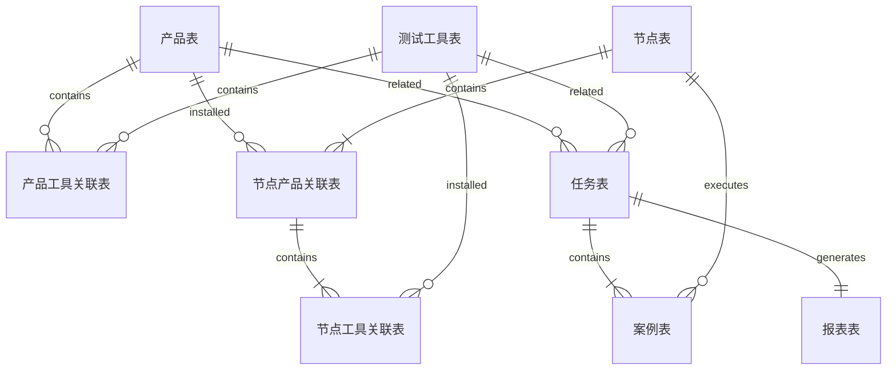

这些 Mermaid 图从不同角度展示了测试管理系统的架构和设计:

1. 简略版服务交互图主要展示了服务之间的 API 调用关系,让我们对系统的整体架构有一个高层次的理解。

2. 服务与数据库关联图展示了每个服务负责管理哪些数据库表,让我们了解服务与数据的关系。

3. 详细版服务交互与数据流图详细展示了服务之间的交互过程和数据流向,让我们深入理解系统的工作流程。

4. 数据库表关联图展示了数据库表之间的关联关系,让我们明确数据的组织和结构。

通过这些不同视角的 Mermaid 图,我们可以全面地理解测试管理系统的架构设计,从而更好地进行开发、维护和扩展。

如果你对这些 Mermaid 图还有任何其他的想法或建议,欢迎随时提出,我们可以一起进一步优化这个设计。


========== 高端的图 ============

当然可以!我可以使用一些更高级的图表和框架来展示测试管理系统的架构设计。下面是几个例子:

1. C4模型 - 系统上下文图:

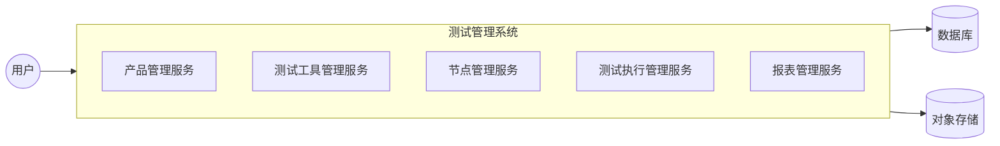

2. UML部署图:

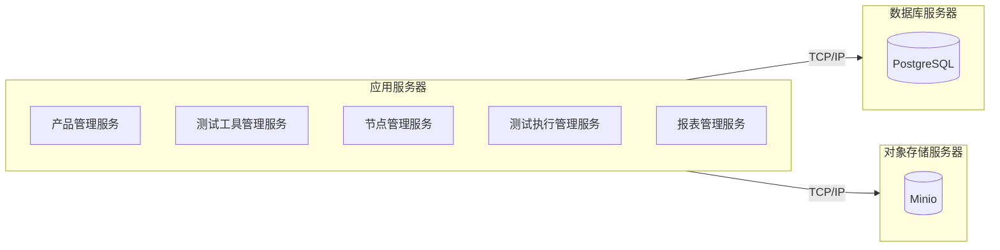

3. 架构分层图:

```tsx
import { HiOutlineDocumentReport, HiOutlineTerminal, HiOutlineServer, HiOutlineDatabase } from "lucide-react"

const colors = {
  blue: '#2196f3',
  green: '#4caf50',
  yellow: '#ffeb3b',
  red: '#f44336',
  purple: '#9c27b0',
  gray: '#607d8b',
}

const Icon = ({ name, color }) => {
  const icons = {
    report: HiOutlineDocumentReport,
    terminal: HiOutlineTerminal,  
    server: HiOutlineServer,
    database: HiOutlineDatabase,
  }
  
  const Component = icons[name]
  
  return <Component size={48} color={color} />
}

const Layer = ({ color, icon, children }) => (
  <div className="p-4 m-2 rounded" style={{ backgroundColor: color }}>
    <div className="flex items-center mb-2">
      <Icon name={icon} color="white" />
      <h3 className="text-lg ml-2 text-white">{children}</h3>
    </div>
  </div>  
)

export default () => (
  <div className="flex flex-col items-center">
    <Layer color={colors.blue} icon="report">
      表现层 (报表管理服务)
    </Layer>
    <Layer color={colors.green} icon="terminal">
      业务逻辑层 (产品、测试工具、节点、测试执行管理服务)  
    </Layer>
    <Layer color={colors.purple} icon="server">
      数据访问层 (服务与数据库、对象存储交互)
    </Layer>
    <Layer color={colors.gray} icon="database">
      基础设施层 (PostgreSQL, Minio)  
    </Layer>
  </div>
)

```

这些图表和框架提供了更高层次、更抽象的系统架构视图:

1. C4模型的系统上下文图展示了测试管理系统与外部实体(用户、数据库、对象存储)的关系,强调了系统的边界和主要组件。

2. UML部署图展示了系统的物理部署结构,包括应用服务器、数据库服务器和对象存储服务器,以及它们之间的通信方式。

3. 架构分层图展示了系统的逻辑分层结构,包括表现层、业务逻辑层、数据访问层和基础设施层,强调了每一层的职责和依赖关系。

这些图表和框架有助于我们从不同的角度理解系统的架构设计,提高系统的可读性、可维护性和可扩展性。同时,这些视觉化的表示方式也使得架构设计更加直观、美观和专业。

如果你对这些图表和框架还有任何其他的想法或建议,欢迎随时提出,我们可以一起进一步优化这个设计。


======== 文字阐述 =========
架构分层图使用 React 组件进行渲染,你可以将代码复制到支持 React 的在线编辑器中查看,如 CodeSandbox 或 StackBlitz。确保在线编辑器已配置好 React 和 Lucide React 图标库。

以下是对整个项目的文字阐述,包括每个服务的职责以及服务之间的联动:

# 测试管理系统

测试管理系统是一个基于微服务架构设计的综合测试管理平台,旨在简化和自动化软件产品的测试流程。系统由多个独立的服务组成,每个服务负责不同的功能,通过 RESTful API 进行通信和数据交换。

## 产品管理服务

产品管理服务负责管理被测软件产品的元数据,包括产品名称、版本号和下载链接等。该服务提供了一组 API,允许其他服务查询和获取产品信息。产品数据存储在 PostgreSQL 数据库的`产品表`中。

## 测试工具管理服务

测试工具管理服务负责管理各种测试工具的元数据,包括工具名称、版本号和下载链接等。该服务提供了一组 API,允许其他服务查询和获取测试工具信息。此外,该服务还管理`产品工具关联表`,用于建立产品和测试工具之间的多对多关系。测试工具数据存储在 PostgreSQL 数据库的`测试工具表`和`产品工具关联表`中。

## 节点管理服务

节点管理服务负责管理测试节点的信息,包括节点的 IP 地址、用户名、密码和状态等。该服务提供了一组 API,允许其他服务查询和获取测试节点信息。此外,该服务还管理`节点产品关联表`和`节点工具关联表`,用于记录每个节点上安装的产品和测试工具。节点数据存储在 PostgreSQL 数据库的`节点表`、`节点产品关联表`和`节点工具关联表`中。

## 测试执行管理服务

测试执行管理服务是系统的核心服务,负责管理和调度测试任务和测试案例的执行。该服务接收来自前端的测试任务请求,根据任务的产品和测试工具要求,通过调用节点管理服务的 API 获取符合条件的测试节点。然后,测试执行管理服务将测试案例分配到选定的节点上执行,并实时监控和记录案例的执行状态和结果。测试任务和案例数据存储在 PostgreSQL 数据库的`任务表`和`案例表`中。

## 报表管理服务

报表管理服务负责根据测试任务和案例的执行结果生成测试报告。该服务通过调用测试执行管理服务的 API 获取任务和案例数据,然后使用内置的报表生成器进行数据分析和可视化,生成包含测试覆盖率、通过率等关键指标的报告。生成的报告数据存储在 PostgreSQL 数据库的`报表表`中,报告文件存储在 Minio 对象存储中。

## 服务联动流程

1. 当用户在前端发起一个新的测试任务时,测试执行管理服务会接收到任务请求。
2. 测试执行管理服务通过调用产品管理服务和测试工具管理服务的 API,获取任务所需的产品和测试工具信息。
3. 测试执行管理服务通过调用节点管理服务的 API,查询符合任务要求的测试节点列表。
4. 测试执行管理服务根据负载均衡算法,将测试案例分配到选定的节点上执行。
5. 测试执行管理服务实时监控案例的执行状态,并将结果写入`案例表`中。
6. 当测试任务完成后,测试执行管理服务触发报表管理服务开始生成测试报告。
7. 报表管理服务通过调用测试执行管理服务的 API,获取任务和案例的执行数据。
8. 报表管理服务使用内置的报表生成器进行数据分析和可视化,生成最终的测试报告。

通过以上流程,测试管理系统的各个服务协同工作,实现了测试任务的自动化调度、执行和报告生成,提高了测试效率和质量。

这份文字阐述提供了测试管理系统的整体架构、各服务的职责以及服务之间的联动流程。你可以根据这份材料,结合之前提供的各种架构图,对系统进行详细的汇报和说明。

如果你还需要任何其他的信息或支持,请随时告诉我,我会尽我所能提供帮助。


======== 宏观 ======

好的,让我从更宏观的角度来描述测试管理系统。

# 测试管理系统概述

测试管理系统是一个基于微服务架构设计的综合测试管理平台,旨在简化和自动化软件产品的测试流程。该系统采用了现代化的架构设计理念,将复杂的测试管理过程分解为多个独立的服务,每个服务负责不同的功能领域,通过明确定义的 API 接口进行通信和协作。

## 系统架构

测试管理系统的架构遵循微服务设计原则,由以下几个关键服务组成:

1. 产品管理服务:负责管理被测软件产品的元数据信息。
2. 测试工具管理服务:负责管理各种测试工具的元数据信息,并建立产品和工具之间的关联关系。
3. 节点管理服务:负责管理测试节点的信息,并记录节点上安装的产品和测试工具。
4. 测试执行管理服务:负责管理和调度测试任务和案例的执行,是系统的核心服务。
5. 报表管理服务:负责根据测试执行结果生成可视化的测试报告。

这些服务各自独立部署,通过 RESTful API 进行通信,实现了服务之间的解耦和可扩展性。同时,系统采用 PostgreSQL 数据库和 Minio 对象存储来持久化存储测试相关的数据和文件。

## 测试流程自动化

测试管理系统的主要目标是实现测试流程的自动化,提高测试效率和质量。通过系统提供的 Web 界面,测试人员可以方便地创建和管理测试任务,定义任务的产品、测试工具和测试案例等信息。

当测试任务被提交后,系统会自动根据任务要求,选择合适的测试节点,并将测试案例分发到节点上执行。整个过程由测试执行管理服务负责调度和监控,确保测试任务的顺利完成。

测试执行的结果会实时反馈给系统,并存储在数据库中。当测试任务完成后,报表管理服务会自动生成可视化的测试报告,包括测试覆盖率、通过率等关键指标,方便测试人员和管理者进行结果分析和质量评估。

## 系统可扩展性

测试管理系统采用微服务架构,具有良好的可扩展性。当系统面临业务增长或者性能瓶颈时,可以方便地对单个服务进行横向扩容,提高系统的处理能力。

同时,由于服务之间通过 API 进行通信,新的功能可以通过添加新的服务来实现,而不会影响现有服务的稳定性。这种架构设计使得系统能够持续演进,适应不断变化的业务需求。

## 总结

综上所述,测试管理系统采用了先进的微服务架构设计,将测试管理过程分解为独立的服务,实现了服务的解耦和可扩展性。通过自动化的测试流程和可视化的报表生成,该系统极大地提高了测试效率和质量,为企业的软件开发和交付过程提供了有力的支持。

这份概述从系统架构、测试流程自动化、可扩展性等方面,对测试管理系统进行了宏观层面的描述。你可以根据这份材料,结合具体的业务场景和需求,对系统的价值和优势进行进一步的阐述和汇报。

如果你还需要任何其他的信息或支持,请随时告诉我,我会尽我所能提供帮助。