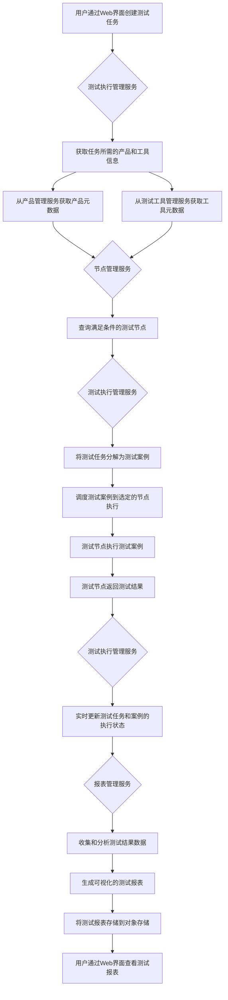

好的,我将为你提供一个 PPT 的大纲,突出整个项目的价值、目标和实现方法。你可以根据这个大纲来创建你的 PPT,并根据需要进行调整和扩展。

# 测试管理系统 - 现代化的测试自动化平台

## 项目背景
- 软件开发过程中,测试是保证产品质量的关键环节
- 传统的测试管理方式效率低下,难以适应快速迭代的开发模式
- 企业迫切需要一个自动化、智能化的测试管理平台

## 项目价值
- 提高测试效率:通过自动化的测试任务调度和执行,显著减少人工操作时间
- 保障产品质量:通过全面的测试覆盖和实时的结果反馈,及时发现和修复缺陷
- 加速上线进度:通过并行的测试执行和智能的资源调度,缩短测试周期
- 降低测试成本:通过测试资源的集中管理和优化利用,减少测试环境的重复投入

## 项目目标
- 建设一个基于微服务架构的测试管理平台
- 实现测试任务的自动化调度和执行
- 提供可视化的测试报表和质量分析
- 支持多种测试工具和环境的集成
- 具备良好的可扩展性和可维护性

## 系统架构
- 微服务架构:独立的服务模块,松耦合、高内聚
- 关键服务:产品管理、测试工具管理、节点管理、测试执行管理、报表管理
- RESTful API:服务间通信的标准接口
- PostgreSQL:测试数据的持久化存储
- Minio:测试报告和文件的对象存储

## 关键功能
- 产品和测试工具的元数据管理
- 测试节点的注册和管理
- 自定义测试任务的创建和调度  
- 测试案例的自动分发和执行
- 实时测试结果的收集和展示
- 自动化测试报告的生成和存储

## 实施路径
- 需求分析:明确业务场景和用户需求
- 架构设计:定义系统组件和交互方式
- 开发实现:按照微服务架构,逐个实现各个服务模块
- 集成测试:服务集成,端到端的功能验证
- 部署上线:服务的容器化部署,配置负载均衡和高可用
- 运维优化:监控服务运行状态,分析和优化性能瓶颈

## 项目收益
- 测试效率提升:预计减少 30% 的人工测试时间
- 产品质量改善:预计提高 20% 的缺陷检出率
- 上线周期缩短:预计缩短 25% 的测试周期
- 测试成本降低:预计节省 20% 的测试环境成本

## 未来展望
- 持续迭代,增强系统的功能和性能
- 集成更多的测试工具和技术,如自动化 UI 测试、性能测试等
- 引入 AI 技术,实现智能测试用例生成和优先级调度
- 扩大系统应用范围,支持更多的项目和团队

这个 PPT 大纲涵盖了测试管理系统的关键要点,包括项目背景、价值、目标、架构、功能、实施路径、收益和未来展望。你可以根据这个大纲,添加具体的内容、数据和图表,创建一个全面而有说服力的 PPT。

如果你在创建 PPT 的过程中需要任何其他的帮助或建议,请随时告诉我。祝你汇报成功!

好的,我为你设计了一个流程图,通过可视化的方式展示测试管理系统是如何工作的。你可以将这个图添加到你的 PPT 中,帮助听众更好地理解系统的运作机制。

这个流程图展示了测试管理系统的端到端工作流程,包括以下关键步骤:

1. 用户通过 Web 界面创建测试任务。
2. 测试执行管理服务获取任务所需的产品和工具信息。
3. 节点管理服务查询满足条件的测试节点。
4. 测试执行管理服务将测试任务分解为测试案例,并调度到选定的节点执行。
5. 测试节点执行测试案例,并返回测试结果。
6. 测试执行管理服务实时更新测试任务和案例的执行状态。
7. 报表管理服务收集和分析测试结果数据,生成可视化的测试报表。
8. 测试报表被存储到对象存储,用户可以通过 Web 界面查看。

通过这个流程图,你可以清晰地向听众展示测试管理系统的各个组件是如何协同工作的,以及系统如何实现测试任务的自动化执行和报表生成。这将有助于听众更好地理解系统的设计理念和实现机制。

如果你需要对这个图进行任何调整或扩展,以更好地适应你的 PPT 内容,请随时告诉我。我很乐意提供更多的帮助和建议。