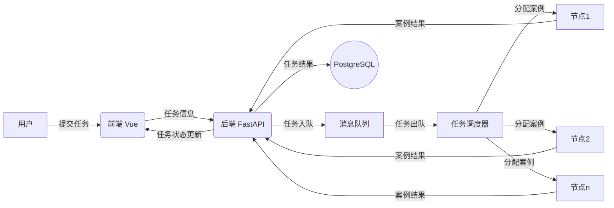
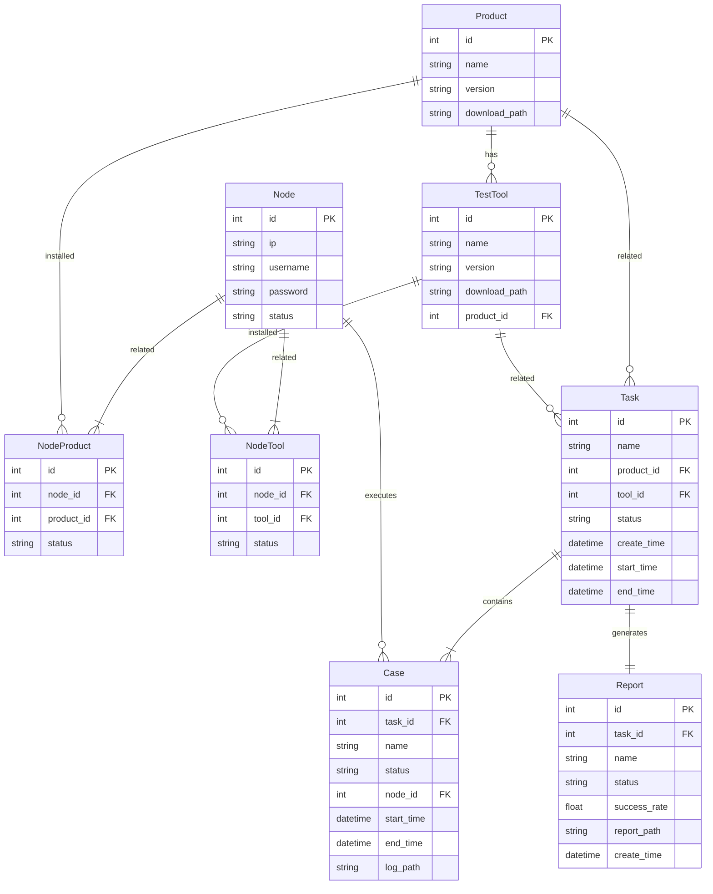
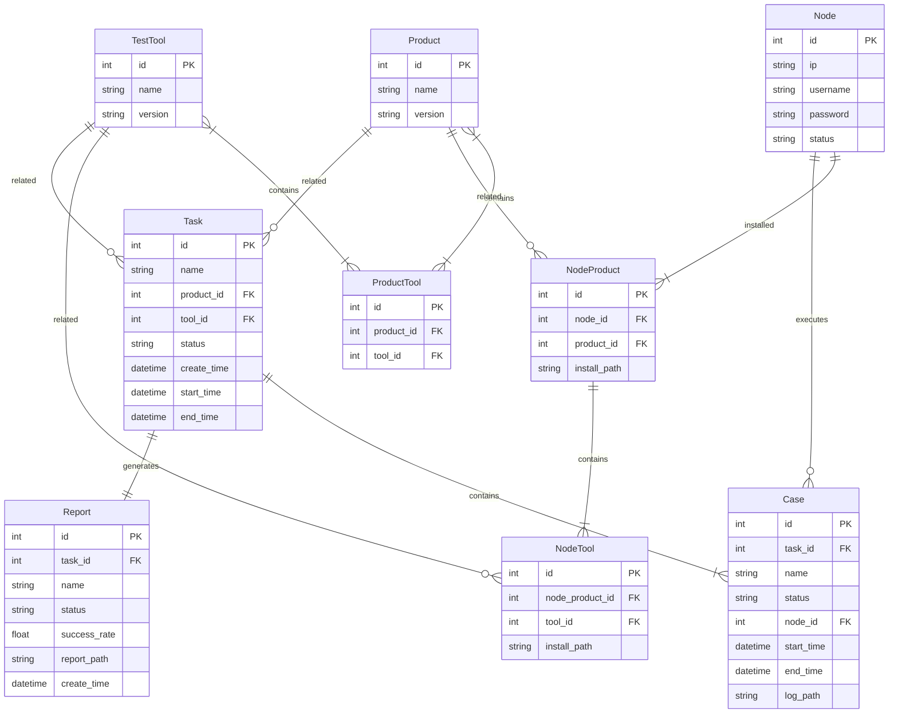
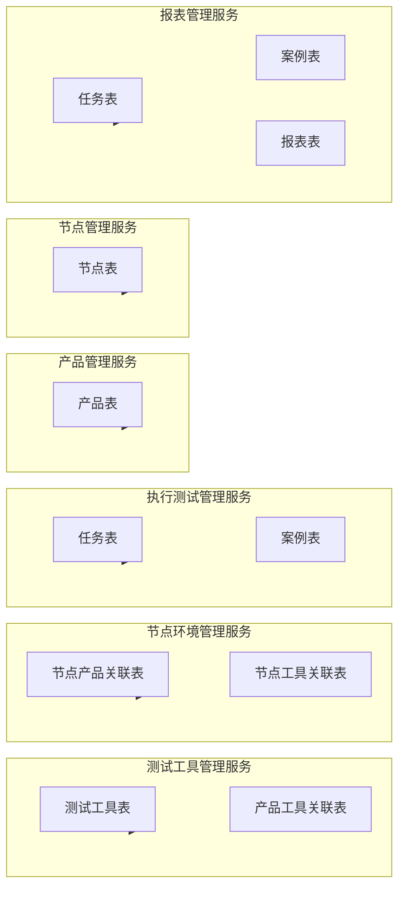
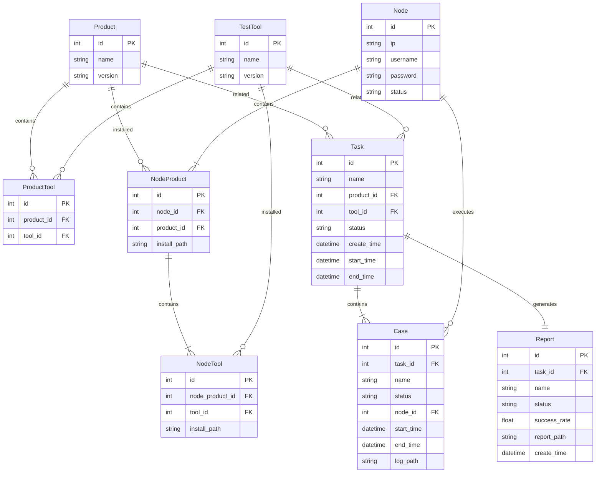
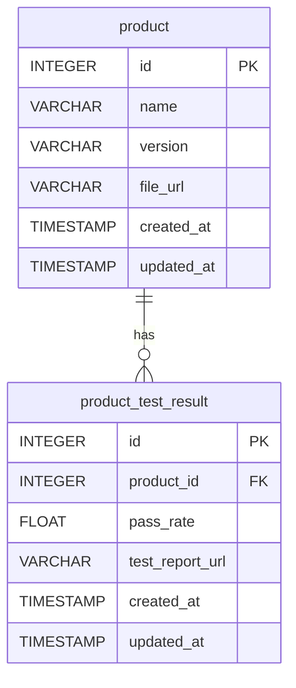

现在你是一个系统架构师。
现在需要实现一个案例测试工具。采用后端fastapi+前端vue的技术。数据库使用postgre

用户可以在前端提交一个任务，任务包括产品名称版本和案例清单。后端接收到后需要找到合适的节点（物理机或者虚拟机）来进行案例运行，因为有多个案例所以案例是一个一个调度给节点进行运行的。而且也可能有多个用户提交任务。所以有多个任务，每个任务有多个案例需要测试。需要实现任务和案例的调度。

请告诉我现在作为系统架构师应该做什么

 作为系统架构师,您现在应该做以下几个步骤:

1. 需求分析与设计
- 明确用户需求,包括用户提交任务的形式、任务包含的信息等
- 设计系统的整体架构,包括前端、后端、数据库的划分与交互方式
- 设计数据库表结构,存储任务、案例等信息
- 设计任务与案例的调度算法,考虑负载均衡、优先级等因素

2. 选择合适的技术栈
- 后端:FastAPI,选择合适的版本,熟悉框架的使用方法
- 前端:Vue,选择合适的版本,熟悉框架的使用方法  
- 数据库:PostgreSQL,选择合适的版本,熟悉数据库的使用方法
- 考虑是否引入其他组件如消息队列(如RabbitMQ、Kafka等)来解耦与异步处理

3. 详细设计与开发
- 完善系统架构图,明确模块间的接口与数据格式
- 设计详细的API接口文档
- 开发后端服务,实现任务提交、存储、调度与案例运行等功能  
- 开发前端页面,实现任务提交、状态展示等交互功能
- 设计与开发数据库,实现数据的持久化存储
  
4. 测试与部署
- 编写单元测试,针对关键功能与接口进行测试
- 搭建测试环境,进行集成测试,确保各模块间的配合
- 编写部署文档,明确部署步骤与环境依赖
- 搭建生产环境,进行上线前的检查,确保平稳过渡

5. 运维与优化
- 配置日志与监控,实时掌握系统运行状态
- 分析系统瓶颈,对高耗时、高资源占用的模块进行优化
- 定期Review系统,确定是否需要引入新技术、升级组件版本等
- 收集用户反馈,持续改进系统的使用体验

综上所述,您作为系统架构师,需要在项目的各个阶段把控全局、提供技术方案,确保系统的可行性、可靠性与可扩展性,引领团队有序地开展工作。

Q:
现在需要进行数据库表设计。我希望达到以下
1. 管理节点，比如含有ip、user、password。
2. 管理产品，包含名称、版本、下载路径
3. 管理测试工具、不同的产品会对应不同的测试工具
4. 管理节点对产品和测试工具的安装，这样我在进行执行任务的时候可以选择符合条件的节点运行
5. 管理任务，每个任务会指定产品和测试工具，可以查看任务的信息
6. 管理案例，每个任务会有多个测试案例，可以查看案例的执行物理机、执行情况等。
7. 管理报表，每个任务完成后可以进行报表生成，会有一些统计数据，比如成功率、报表路径等。

现在我想划分为多个微服务。都是用fastapi的后端。比如
1. 产品库管理，用来管理产品库和测试工具
2. 节点管理
3. 节点产品管理、用户进行节点对产品和测试工具的安装删除等
4. 结果分析管理
5. 执行测试的调度管理服务

你需要帮我改进和设计表结构。以及提出更合理的微服务或者表结构。

A:
根据您提供的需求,我对微服务的划分和数据库表结构设计提出以下建议:

微服务划分:
1. 产品与工具管理服务
2. 节点管理服务
3. 节点产品关联服务
4. 任务管理服务
5. 案例管理服务
6. 报表管理服务

数据库表结构设计:

1. 产品与工具管理服务
- 产品表(Product): id, name, version, download_path
- 测试工具表(TestTool): id, name, version, download_path, product_id(外键关联产品表)

2. 节点管理服务 
- 节点表(Node): id, ip, username, password, status

3. 节点产品关联服务
- 节点产品关联表(NodeProduct): id, node_id(外键关联节点表), product_id(外键关联产品表), status
- 节点工具关联表(NodeTool): id, node_id(外键关联节点表), tool_id(外键关联测试工具表), status

4. 任务管理服务
- 任务表(Task): id, name, product_id(外键关联产品表), tool_id(外键关联测试工具表), status, create_time, start_time, end_time

5. 案例管理服务  
- 案例表(Case): id, task_id(外键关联任务表), name, status, node_id(外键关联节点表), start_time, end_time, log_path

6. 报表管理服务
- 报表表(Report): id, task_id(外键关联任务表), name, status, success_rate, report_path, create_time

关于微服务的划分和职责:
1. 产品与工具管理服务:负责管理产品和测试工具的信息,提供增删改查等接口。
2. 节点管理服务:负责管理测试节点,提供节点的注册、删除、状态更新等接口。 
3. 节点产品关联服务:负责管理节点与产品、工具的关联关系,提供节点安装、删除产品与工具等接口。
4. 任务管理服务:负责管理测试任务,提供任务的创建、删除、状态查询等接口,并向案例管理服务发送案例运行请求。
5. 案例管理服务:负责管理测试案例,接收任务管理服务的案例运行请求,选择合适的节点运行案例,并收集案例运行结果。
6. 报表管理服务:负责管理测试报告,从案例管理服务接收案例运行结果,生成并保存测试报告。

以上是我对微服务划分和数据库表结构设计的建议,旨在实现职责分离、解耦合、提高可维护性和可扩展性。您可以根据实际情况进行调整和完善。在实现过程中,还需要考虑各服务间的通信方式(如REST API、消息队列等)、数据一致性保证机制等问题。

Q: 有个问题就是，一个产品可能对应多个测试工具，一个测试工具也可能对应多个产品。 也就是说一个产品可能有多种测试工具，然后并不是节点会安装全部的测试工具、我希望在界面处用户可以选择该节点的该产品有个多选框，选择安装哪些测试工具。 测试的时候也是，当选择了一个产品也会有个下拉框让选择使用哪种测试工具来测试。我感觉是有一个表来管理产品和测试工具的关系，另一个表是来管理某个节点安装了哪些节点和测试工具（也就是上段话的表），和在本机的存放路径

A:
非常好的问题!您提出的需求非常合理。为了满足这些需求,我对数据库表结构进行了一些调整和优化。下面是优化后的设计:

1. 产品表(Product): id, name, version
2. 测试工具表(TestTool): id, name, version
3. 产品工具关联表(ProductTool): id, product_id(外键关联产品表), tool_id(外键关联测试工具表)
4. 节点表(Node): id, ip, username, password, status
5. 节点产品关联表(NodeProduct): id, node_id(外键关联节点表), product_id(外键关联产品表), install_path
6. 节点工具关联表(NodeTool): id, node_product_id(外键关联节点产品关联表), tool_id(外键关联测试工具表), install_path
7. 任务表(Task): id, name, product_id(外键关联产品表), tool_id(外键关联测试工具表), status, create_time, start_time, end_time
8. 案例表(Case): id, task_id(外键关联任务表), name, status, node_id(外键关联节点表), start_time, end_time, log_path
9. 报表表(Report): id, task_id(外键关联任务表), name, status, success_rate, report_path, create_time

主要变化:
1. 产品表和测试工具表拆分为独立的两个表,减少了冗余。
2. 新增产品工具关联表,用于管理产品和测试工具的多对多关系。
3. 节点产品关联表新增install_path字段,用于存储产品在节点上的安装路径。
4. 节点工具关联表调整为与节点产品关联表关联,并新增install_path字段,用于存储工具在节点上的安装路径。
5. 任务表的tool_id字段调整为与测试工具表关联。

这样调整后,可以很好地满足您提出的需求:
1. 用户可以在界面上通过多选框选择节点要安装的测试工具,这些信息保存在节点工具关联表中。
2. 在创建测试任务时,可以先选择产品,然后根据产品工具关联表,动态加载该产品关联的测试工具供用户选择。
3. 节点产品关联表和节点工具关联表记录了产品和工具在节点上的安装路径,便于测试任务的执行和管理。

希望这些优化能够更好地满足您的需求。如果还有其他问题或建议,欢迎随时提出!

Q: 我现在你能给我数据库表和服务的关系，比如哪些服务用了哪些数据库表，管理哪些数据库表。然后如果能给图的话就最好

好的,根据您的要求,我对服务进行了重新划分,拆分了产品与工具管理服务,新增了单独的产品管理服务。调整后的服务划分如下:

1. 产品管理服务
   - 管理的表:产品表(Product)
   - 提供的功能:产品的增删改查等管理操作

2. 测试工具管理服务
   - 管理的表:测试工具表(TestTool)、产品工具关联表(ProductTool)
   - 提供的功能:测试工具的增删改查,以及工具与产品关联关系的管理

3. 节点管理服务
   - 管理的表:节点表(Node)
   - 提供的功能:测试节点的注册、删除、状态更新等

4. 节点环境管理服务
   - 管理的表:节点产品关联表(NodeProduct)、节点工具关联表(NodeTool)  
   - 提供的功能:管理节点上产品和测试工具的安装、配置、删除等操作

5. 执行测试管理服务
   - 管理的表:任务表(Task)、案例表(Case)
   - 提供的功能:创建和管理测试任务,对任务进行调度,将案例分配到合适的节点上执行,监控案例执行进度,收集执行结果并发送给报表管理服务

6. 报表管理服务
   - 关联的表:任务表(Task)、案例表(Case)、报表表(Report)
   - 提供的功能:从执行测试管理服务接收案例运行结果,关联任务和案例信息生成详细的测试报告

下面是更新后的服务与数据库表关系图:

通过将产品管理服务独立出来,现在每个服务的职责更加单一和清晰:

1. 产品管理服务专注于产品的管理。
2. 测试工具管理服务负责管理测试工具以及工具与产品的关联关系。 
3. 节点管理服务负责节点的管理。
4. 节点环境管理服务负责节点上产品和工具的安装、配置等。
5. 执行测试管理服务负责测试任务的创建、调度、执行和监控。
6. 报表管理服务负责根据任务和案例的执行情况生成详细报表。

这样的划分使得每个服务的功能更加内聚,同时也降低了服务间的耦合度,有利于系统的维护和扩展。

如果您对这个设计还有任何其他的想法或建议,欢迎随时提出,我们可以一起进一步优化这个方案。

现在能重新给我数据库表的图和关系吗

当然可以!根据最新的服务划分,我重新设计了数据库表结构和关系,下面是更新后的ER图:

数据库表关系说明:

1. Product表和TestTool表通过ProductTool表建立多对多关系,表示一个产品可以对应多个测试工具,一个测试工具也可以属于多个产品。

2. Node表和Product表通过NodeProduct表建立多对多关系,表示一个节点可以安装多个产品,一个产品也可以被安装在多个节点上。

3. NodeProduct表和TestTool表通过NodeTool表建立多对多关系,表示一个节点上的某个产品可以安装多个测试工具,一个测试工具也可以被安装在多个节点的不同产品上。

4. Task表与Product表和TestTool表分别建立多对一关系,表示一个任务关联一个特定的产品和测试工具。

5. Case表与Task表建立多对一关系,表示一个任务包含多个案例。Case表与Node表建立多对一关系,表示一个案例在某个特定节点上执行。

6. Report表与Task表建立一对一关系,表示一个任务生成一个测试报告。

以上就是根据最新的服务划分设计的数据库表结构和关系。这种设计可以很好地支持各个服务的功能需求,同时也考虑了表之间的关联关系,避免了数据冗余和不一致的问题。

如果您对这个设计还有任何疑问或建议,欢迎随时提出,我们可以一起进一步完善这个方案。

Q:请给我最简单的接口路径就好、不用给请求和相应体。我还需要几个额外的接口，因为上传了产品之后 其他服务会对该产品进行测试，会获得该产品的通过率等信息。所以需要有个接口来让其他服务来更新该APP的通过率等

A:好的,以下是产品管理服务的完整接口路径列表,包括新增的用于更新产品测试结果的接口:

1. 获取session_id接口
   - 请求方法: POST
   - 路径: /products/session/

2. 创建产品接口
   - 请求方法: POST
   - 路径: /products/

3. 上传产品文件接口
   - 请求方法: POST
   - 路径: /products/upload/

4. 获取产品列表接口
   - 请求方法: GET
   - 路径: /products/

5. 获取单个产品详情接口
   - 请求方法: GET
   - 路径: /products/{product_id}/

6. 更新产品接口
   - 请求方法: PUT
   - 路径: /products/{product_id}/

7. 删除产品接口
   - 请求方法: DELETE
   - 路径: /products/{product_id}/

8. 更新产品测试结果接口
   - 请求方法: PUT
   - 路径: /products/{product_id}/test-result/

9. 获取产品测试结果接口
   - 请求方法: GET
   - 路径: /products/{product_id}/test-result/

对于更新产品测试结果接口,其他服务在完成对产品的测试后,可以调用该接口将测试结果(如通过率等信息)更新到产品记录中。这样,产品管理服务就可以集中管理产品的基本信息和测试结果。

同时,我们还提供了获取产品测试结果接口,方便其他服务或前端应用查询产品的测试结果。

以上就是完整的产品管理服务接口设计,包括了产品的创建、读取、更新、删除等基本操作,以及产品文件上传和测试结果管理的功能。这样设计可以使产品管理服务成为一个相对独立且功能完善的微服务。

如果你对接口设计有任何其他的想法或建议,欢迎随时提出,我们可以一起进一步优化这个方案。

A:
好的,我将为你编写一份详细的产品库设计文档,包括需求文档、功能文档和数据库设计。

# 产品库设计文档

## 1. 概述
产品库是一个集中管理产品信息的系统,为其他服务提供产品的基本信息和测试结果查询。本文档将详细描述产品库的需求、功能和数据库设计。

## 2. 需求文档

### 2.1 功能需求
- 产品的创建、读取、更新和删除操作
- 产品文件的上传和下载链接管理
- 产品测试结果的更新和查询
- 提供 RESTful API 供其他服务调用

### 2.2 非功能需求
- 高可用性:系统应该能够持续稳定运行,避免单点故障
- 可扩展性:系统应该能够轻松扩展,以应对业务增长带来的数据量和并发量增加
- 安全性:系统应该提供必要的安全措施,保护敏感数据,如身份验证和授权
- 可维护性:系统应该易于维护和升级,代码结构清晰,注释完整

## 3. 功能文档

### 3.1 产品管理
- 创建产品:通过 RESTful API 创建新的产品记录
- 读取产品:通过 RESTful API 获取单个产品详情或产品列表
- 更新产品:通过 RESTful API 更新产品的基本信息
- 删除产品:通过 RESTful API 删除指定的产品记录

### 3.2 产品文件管理
- 文件上传:通过 RESTful API 上传产品文件到对象存储(如 Minio),并将文件下载链接保存到产品记录中
- 文件下载:通过产品记录中的文件下载链接,可以从对象存储下载产品文件

### 3.3 产品测试结果管理
- 更新测试结果:通过 RESTful API 更新指定产品的测试结果,如通过率等信息
- 查询测试结果:通过 RESTful API 获取指定产品的测试结果

## 4. 数据库设计

### 4.1 产品表(product)

| 字段名 | 数据类型 | 说明 |
|-------|---------|------|
| id | INTEGER | 产品ID,主键 |
| name | VARCHAR | 产品名称 |
| version | VARCHAR | 产品版本号 |
| file_url | VARCHAR | 产品文件下载链接 |
| created_at | TIMESTAMP | 创建时间 |
| updated_at | TIMESTAMP | 更新时间 |

### 4.2 产品测试结果表(product_test_result)

| 字段名 | 数据类型 | 说明 |
|-------|---------|------|
| id | INTEGER | 测试结果ID,主键 |
| product_id | INTEGER | 关联的产品ID,外键 |
| pass_rate | FLOAT | 测试通过率 |
| test_report_url | VARCHAR | 测试报告下载链接 |
| created_at | TIMESTAMP | 创建时间 |
| updated_at | TIMESTAMP | 更新时间 |

### 4.3 关系图

以上是产品库的详细设计文档,包括需求文档、功能文档和数据库设计。这个设计旨在提供一个可扩展、可维护、安全且高可用的产品管理服务。

如果你对设计有任何其他的想法或建议,欢迎随时提出,我们可以一起进一步优化这个方案。

